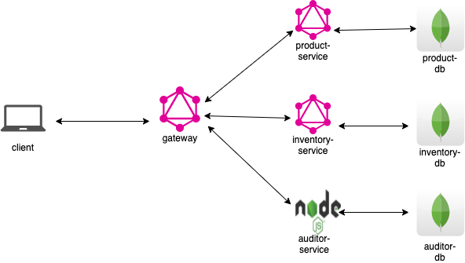

# ECOMMERCE SPECIFICATIONS

## System Overview

This project use the concepts of [GraphQL Federation Gateway](https://www.apollographql.com/docs/apollo-server/federation/introduction/) from Apollo, an Apollo Federation consists of:
  - A collection of implementing services that each define a distinct GraphQL schema
  - A gateway that composes the distinct schemas into a federated data graph and executes queries across the services in the graph

Additionally, there's also an `auditor-service` that running as an REST APIs for receiving auditor request from the `gateway`

See the image below: 



| Component                  | Environments                                    |
| -------------------------- | ------------------------------------------------|
| Gateway                    | Node.js 10.x, Apollo Gateway                    |
| Product Service            | Node.js 10.x, Apollo Federated Server           |
| Inventory Service          | Node.js 10.x, Apollo Federated Server           |
| Auditor Service            | Node.js 10.x, Express Server                    |


## Project structure of a service

- ./app/datasources: handle all fetching data operations, an GraphQL query can fetch data from multiple datasources
- ./app/schemas: GraphQL schema
- ./app/resolvers: GraphQL resolver for resolve data fields

## Client - Server communication

### User search products


## MongoDB Database schemas

### Product DB

| mongoDB collection | Schema name    |
| ------------------ | -------------- |
| products           | ProductSchema |

```javascript
{
  sku: String,
  name: String,
  price: Number,
  branch: String,
  colour: String,
}
```

Where:

| Fields    | Description                    |
| --------- | ------------------------------ |
| name      | product name                   |
| price     | product price                  |
| branch    | product branch                 |
| colour    | product colour                 |

### Inventory DB

| mongoDB collection | Schema name    |
| ------------------ | -------------- |
| products           | ProductSchema |

```javascript
{
  sku: String,
  inventoryCount: Number,
}
```

Where:

| Fields         | Description                    |
| -------------- | ------------------------------ |
| sku            | product sku                    |
| inventoryCount | product inventoryCount         |

### Auditor DB

| mongoDB collection | Schema name    |
| ------------------ | -------------- |
| audits             | AuditSchema |

```javascript
{
  action: String,
  parameters: Object,
  isSuccess: Boolean,
  statusCode: Number,
  reason: String,
  accessLog: String,
}
```

Where:

| Fields         | Description                    |
| -------------- | ------------------------------ |
| action         | audit action                   |
| parameters     | action params                  |
| isSuccess      | action status                  |
| statusCode     | http status code               |
| reason         | action error message           |
| accessLog      | accessLog                      |

## GraphQL APIs

### Queries

#### Search products

```javascript
type Query {
  products(filter: ProductFilter, limit: Int): [Product]!
}
```

#### Get product by id

```javascript
type Query {
  product(id: ID!): Product
}
```

### Input

#### Product Filter

```javascript
input ProductFilter {
  sortBy: String
  sortDirection: String
  priceRange: PriceRange
  branch: String
  name: String
  cursor: Float
}
```

### Types

#### Product

```javascript
type Product {
  id: ID!
  sku: String
  name: String
  price: Float
  branch: String
  colour: String
  inventoryCount: Int
}
```

## Run the project

### Prerequisite

- Docker

Run the following command: `sh start.sh`
Navigate to http://localhost:6776/graphql, you should see a GraphQL Playgournd like this:


## Sample queries

### Search product by name, branch and price, sort by price DESC

#### Query:

```javascript
query {
  products(filter: {
    sortBy: "price"
    sortDirection: "desc"
  }) {
    id
    sku
    name
    price
    
    branch
    colour
    inventoryCount
  }
}
```

#### Response

```javascript
{
  "data": {
    "products": [
      {
        "id": "5f1642ed3703e3e1afd30d20",
        "sku": "8",
        "name": "iphone 8",
        "price": 720,
        "branch": "apple",
        "colour": "gold",
        "inventoryCount": 39
      },
      {
        "id": "5f1642ed3703e3e1afd30d1e",
        "sku": "6",
        "name": "iphone 8",
        "price": 700,
        "branch": "apple",
        "colour": "white",
        "inventoryCount": 200
      },
      {
        "id": "5f1642ed3703e3e1afd30d1f",
        "sku": "7",
        "name": "iphone 8",
        "price": 690,
        "branch": "apple",
        "colour": "silver",
        "inventoryCount": 121
      },
      {
        "id": "5f1642ed3703e3e1afd30d1b",
        "sku": "4",
        "name": "iphone 7",
        "price": 520,
        "branch": "apple",
        "colour": "red",
        "inventoryCount": 10
      },
      {
        "id": "5f1642ed3703e3e1afd30d1d",
        "sku": "5",
        "name": "iphone 7",
        "price": 500,
        "branch": "apple",
        "colour": "silver",
        "inventoryCount": 900
      },
      {
        "id": "5f1642ed3703e3e1afd30d1c",
        "sku": "5",
        "name": "iphone 7",
        "price": 499,
        "branch": "apple",
        "colour": "blue",
        "inventoryCount": 900
      },
      {
        "id": "5f1642ed3703e3e1afd30d1a",
        "sku": "3",
        "name": "iphone 6",
        "price": 401,
        "branch": "apple",
        "colour": "white",
        "inventoryCount": 100
      },
      {
        "id": "5f1642ed3703e3e1afd30d18",
        "sku": "1",
        "name": "iphone 6",
        "price": 400,
        "branch": "apple",
        "colour": "gold",
        "inventoryCount": 500
      },
      {
        "id": "5f1642ed3703e3e1afd30d19",
        "sku": "2",
        "name": "iphone 6",
        "price": 399,
        "branch": "apple",
        "colour": "pinky",
        "inventoryCount": 40
      }
    ]
  }
}
```

### Get product by id

#### Query

```javascript
query {
	product(id: "5f1642ed3703e3e1afd30d20") {
    id
    sku
    name
    price
    
    branch
    colour    
  }
}
```

#### Response

```javascript
{
  "data": {
    "product": {
      "id": "5f1642ed3703e3e1afd30d20",
      "sku": "8",
      "name": "iphone 8",
      "price": 720,
      "branch": "apple",
      "colour": "gold"
    }
  }
}
```